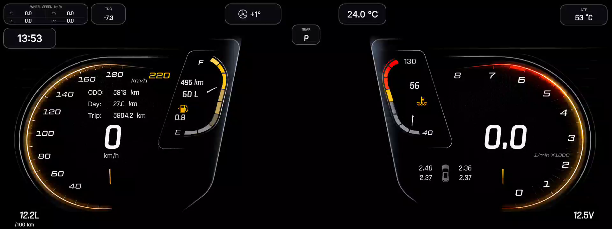
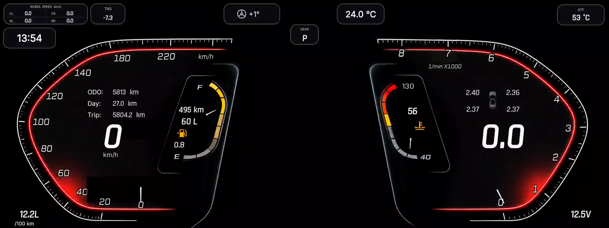
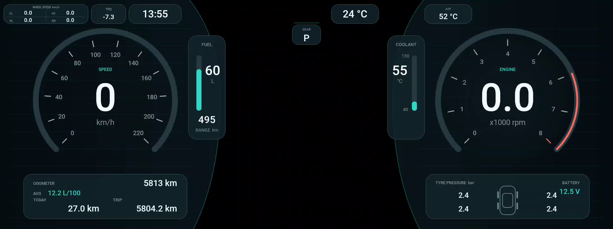
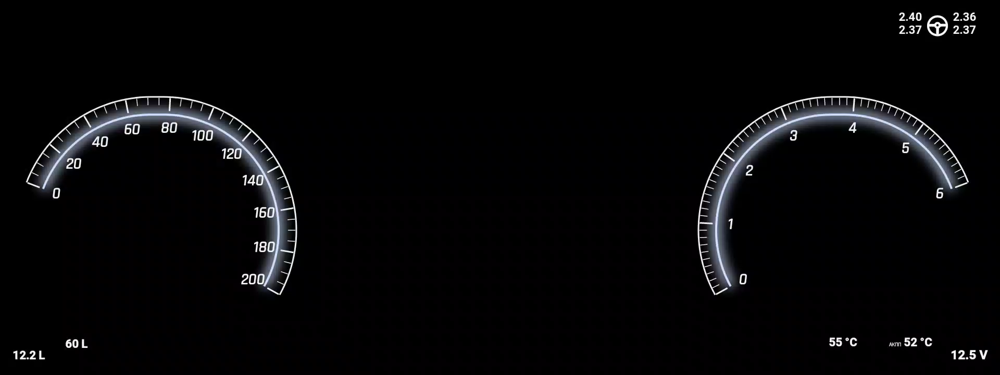

# H9 Cluster 9.4.0

[](https://github.com/Arkasha18/H9-cluster/actions/workflows/android-ci.yml)
[](https://github.com/Arkasha18/H9-cluster/releases/latest)
[](LICENSE)

Неофициальная приборная панель для Haval H9 с головным устройством на Android 9
и дополнительным экраном `Display ID 2` размером `1920×720`.

- Package name: `net.adminrunet.h9cluster`
- Разработчик: `admin.ru.net`
- Контакт: [arkasha18@gmail.com](mailto:arkasha18@gmail.com)
- Модель распространения: **source-available**

Проект не связан с Great Wall Motor, Haval или производителем головного
устройства и не одобрен ими. Названия и товарные знаки принадлежат их
правообладателям.

## Скины

Все четыре темы сняты на реальном `Display ID 2` в разрешении `1920×720`.
Изображения открываются в полном размере по клику.

| Classic | Sport |
| --- | --- |
| [](docs/images/skins/classic-1920x720.png) | [](docs/images/skins/sport-1920x720.png) |

| Horizon | Simple |
| --- | --- |
| [](docs/images/skins/horizon-1920x720.png) | [](docs/images/skins/simple-1920x720.png) |

Описание особенностей каждой темы и полноразмерная галерея приведены в
[документации по скинам](docs/SKINS_RU.md).

## Возможности

- независимые темы `Classic`, `Sport`, `Horizon` и `Simple`;
- отдельно откалиброванные по печатным делениям стрелки спидометра и
  тахометра в темах `Classic` и `Sport`;
- скорость, обороты, пробег, топливо и запас хода;
- температура охлаждающей жидкости и наружного воздуха;
- температура масла автоматической трансмиссии;
- угол рулевого колеса;
- давление в четырёх шинах;
- четыре отдельные скорости колёс;
- момент маховика, расход топлива и напряжение бортовой сети;
- выбор темы на основном экране;
- вариант `Штатная панель`: приложение ничего не рисует и на `Display ID 2`
  остаётся заводская приборная панель;
- независимые настройки конкретной темы, если она предоставляет собственный
  редактор;
- кнопка `Выйти из приложения` на экране настроек: панель на `Display ID 2`
  закрывается, чтение автомобильных данных прекращается;
- автоматический запуск панели на `Display ID 2`.

## Источники данных и безопасность

Основные автомобильные данные читаются через штатный Binder-сервис:

```text
com.gwm.android.adapter.server.GwmAdapterService
```

Приложение использует только операции чтения, регистрацию слушателя и снятие
регистрации. Команды управления автомобилем, запись параметров и активные
диагностические запросы не выполняются.

Для высокочастотного чтения оборотов используется read-only подписка на
`svc://fdbus_mcu_ipc`. Необходимые ARM64-библиотеки из штатной системы
головного устройства находятся в `app/src/main/jniLibs/arm64-v8a/` и
включаются в APK. Это сторонние бинарные компоненты; лицензия проекта на них
не распространяется. Подробности приведены в
[THIRD_PARTY_NOTICES.md](THIRD_PARTY_NOTICES.md).

Если совместимые нативные библиотеки отсутствуют или не загружаются, приложение
автоматически продолжает работу и получает RPM через Binder; тахометр при этом
может обновляться реже.

Температура масла АКПП читается без CAN-команд и UDS-запросов из уже
обновляемого штатным ПО снимка `/dev/shm/can_data_collect` на TBOX. Приложение
подключается к TBOX только для выполнения команды чтения; firewall, файлы и
настройки TBOX не изменяются.

Пароль TBOX не хранится в репозитории. Перед production-сборкой передайте его
как Gradle property либо переменную окружения:

```bash
H9_TBOX_PASSWORD='...' ./gradlew assembleRelease
```

Для GitHub Actions используйте Repository Secret `H9_TBOX_PASSWORD`. Во время
сборки пароль преобразуется в две случайно маскированные последовательности,
поэтому открытой строки в DEX нет. Без секрета APK собирается нормально, но
источник температуры АКПП остаётся отключённым.

Маскирование защищает только от простого поиска строки и не является
криптографическим хранилищем: автономный APK технически содержит всё
необходимое для восстановления секрета во время работы. Не используйте в
публичных сборках пароль, применяемый для других систем.

Значение для интерфейса приходит в общем `ClusterState`:

- `transmissionTemperatureC` — температура в градусах Цельсия;
- `hasTransmissionTemperature()` — `false`, пока первое значение не получено;
- `transmissionTemperatureUpdatedAtMs` — время последнего обновления по
  `SystemClock.elapsedRealtime()`.

Для разовой проверки масштаба одометра и среднего расхода поездки на машине
есть отдельный безопасный и ограниченный по частоте тег. По умолчанию он
выключен во всех сборках, включая release, и включается только явным opt-in:

```bash
adb shell setprop log.tag.H9TripTelemetry DEBUG
adb logcat -s H9TripTelemetry:D
```

Он выводит только числовые значения текущего счётчика поездки, преобразованного
расстояния, среднего расхода `cur_journey_avg_fuel_consumption_a` с признаками
валидности, оборотов, скорости и monotonic timestamp — не чаще одного раза в
секунду. Мгновенный расход в логе и в расчётах не участвует: на голове
`car.basic.instant_fuel_consumption` отдаёт `NaN`.

Чтобы снова выключить лог:

```bash
adb shell setprop log.tag.H9TripTelemetry ""
```

Перед публикацией фрагментов logcat убедитесь, что в них нет других тегов с
VIN, координатами или служебными данными автомобиля.

Карточка `ATF` выводится во всех зарегистрированных темах справа от защищённой
зоны штатного правого поворотника. Если значение не получено либо не
обновлялось более
15 секунд, интерфейс показывает `— °C`.

Цвет числа и рамки карточки помогает заметить рост температуры:

- до `99 °C` — штатный белый цвет;
- `100–109 °C` — жёлтый;
- `110–119 °C` — оранжевый;
- от `120 °C` — красный.

Для защиты от переключения цветов около границы используется гистерезис:
возврат из красного диапазона происходит ниже `115 °C`, из оранжевого — ниже
`107 °C`, из жёлтого — ниже `97 °C`. Это информационные пороги интерфейса, а
не замена штатному индикатору перегрева и требованиям руководства автомобиля.

Карточка `GEAR` показывает положение селектора: `P` — паркинг, `R` — задний
ход, `N` — нейтраль. В положении движения вперёд и в ручном режиме к букве
добавляется номер включённой ступени, например `D3` и `M2`; пока номер не
получен, остаётся одна буква. Числовые коды положений, которые отдаёт штатный
адаптер, сняты на автомобиле и перечислены в `GearSelector`.

Исключение — тема `Simple`: она рисует номер ступени только в положении `D`.
В остальных положениях поле пустое, чтобы не дублировать заводскую надпись
рядом с этим местом.

## Сборка

### Воспроизводимая Docker-сборка

Docker-образ содержит JDK 17, Android SDK 35 и Python-зависимости инструментов
создания тем. Исходники, APK и ключи подписи в образ не копируются.

На компьютерах Apple Silicon также указывайте `linux/amd64`, поскольку Android
Build Tools внутри контейнера рассчитаны на эту архитектуру:

```bash
docker build --platform linux/amd64 -t h9-cluster-build .
docker run --rm --platform linux/amd64 \
  -v "$PWD:/workspace" -w /workspace \
  h9-cluster-build
```

По умолчанию контейнер выполняет `assembleDebug` и `lint`. Готовый образ из
GitHub Container Registry можно использовать без локальной сборки:

```bash
docker pull --platform linux/amd64 \
  ghcr.io/arkasha18/h9-cluster-build:android35-jdk17
docker run --rm --platform linux/amd64 \
  -v "$PWD:/workspace" -w /workspace \
  ghcr.io/arkasha18/h9-cluster-build:android35-jdk17
```

### Локальная сборка

Требуются:

- JDK 17;
- Android SDK Platform 35;
- Android SDK Build Tools 35;
- ARM64-устройство с Android 9 для проверки в автомобиле.

Debug APK собирается без ключей:

```bash
./gradlew assembleDebug
```

Результат:

```text
app/build/outputs/apk/debug/app-debug.apk
```

Автономный Demo APK с автоматически меняющимися тестовыми значениями:

```bash
./gradlew assembleDemo
```

Результат:

```text
app/build/outputs/apk/demo/app-demo.apk
```

Demo не подключается к GWM Adapter, FDBus, CAN или TBOX. Для проверки на одном
экране эмулятора:

```bash
adb shell settings delete global overlay_display_devices
adb shell wm size 1920x720
adb shell wm density 240
./gradlew installDemo
adb shell am start -W \
  -n net.adminrunet.h9cluster.demo/net.adminrunet.h9cluster.SettingsActivity
```

Кнопка сохранения откроет приборную панель на том же экране. Чтобы проверить
экран итогов поездки:

1. подождите не менее секунды, пока будет подтверждён запуск двигателя;
2. нажмите на левый спидометр;
3. подождите 1,5 секунды подтверждения остановки;
4. проверьте расстояние, средний расход и длительность;
5. нажмите на экран итогов, чтобы вернуться к настройкам.

Клик вне левого спидометра и системная кнопка Back также возвращают настройки.
Чтобы вернуть стандартный размер эмулятора:

```bash
adb shell wm size reset
adb shell wm density reset
```

Для двухэкранной проверки:

```bash
adb shell settings put global overlay_display_devices '1920x720/240'
adb shell am force-stop net.adminrunet.h9cluster.demo
adb shell am start -W \
  -n net.adminrunet.h9cluster.demo/net.adminrunet.h9cluster.SettingsActivity
```

При наличии `Display ID 2` приборная панель автоматически откроется на нём.

Для воспроизводимой проверки недоступного расхода можно напрямую запустить
Demo preview с тестовым параметром:

```bash
adb shell am start -W \
  -n net.adminrunet.h9cluster.demo/net.adminrunet.h9cluster.PreviewActivity \
  --ez demo_invalid_consumption true
```

После остановки средний расход и израсходованное топливо будут показаны как
`—`, а расстояние и длительность останутся числовыми.

Итоги поездки считаются только по двум штатным read-only сигналам:
`car.basic.cur_journey_odometer` для расстояния и
`car.basic.cur_journey_avg_fuel_consumption_a` для среднего расхода, откуда
получается израсходованное топливо. Показатель `car.basic.avg_fuel_consumption`
(индикатор B) используется только шкалой приборки и никогда не подменяет A в
итогах: если A недоступен, невалиден или источник перестал публиковать значение,
расход и топливо показываются как `—`.

Поездка завершается только по фактически полученному значению `RPM ≤ 50` при
нулевой скорости, удержанному 1,5 секунды. Само по себе отсутствие обновлений
RPM остановкой двигателя не считается: на холостом ходу шина может молчать
сколь угодно долго, и поездка остаётся активной. Обратная сторона — при обрыве
телеметрии до прихода нулевых оборотов итог поездки не появится.

Даже если `H9_TBOX_PASSWORD` настроен локально, Demo variant принудительно
оставляет поля секрета пустыми. Проверка unit-контракта, APK и lint:

```bash
./gradlew testDemoUnitTest lintDemo assembleDemo
tools/verify_demo_apk_secrets.sh \
  app/build/outputs/apk/demo/app-demo.apk
```

Для release-сборки используйте собственный ключ. Секреты рекомендуется хранить
в пользовательском `~/.gradle/gradle.properties`, который находится за
пределами репозитория:

```properties
H9_CLUSTER_STORE_FILE=/absolute/path/to/your-release-key.p12
H9_CLUSTER_STORE_TYPE=PKCS12
H9_CLUSTER_STORE_PASSWORD=your-password
H9_CLUSTER_KEY_ALIAS=your-key-alias
H9_CLUSTER_KEY_PASSWORD=your-password
```

После этого:

```bash
./gradlew assembleRelease
```

Файлы ключей, локальные свойства, APK/AAB и каталоги сборки исключены через
`.gitignore`.

Порядок выпуска подписанной версии приведён в
[docs/RELEASING_RU.md](docs/RELEASING_RU.md).

## Непрерывная интеграция

GitHub Actions для каждого Pull Request:

1. собирает зафиксированный Docker toolchain;
2. проверяет генерацию Forum Kit и обработку графики темы;
3. тестирует, проверяет lint и собирает Debug и Demo variants;
4. проверяет отсутствие TBOX secret material в Demo APK;
5. сохраняет Debug и Demo APK отдельными временными Actions artifacts;
6. после попадания проверенного commit в `main` публикует toolchain в GHCR.

Production-ключ не используется GitHub Actions и должен оставаться только на
компьютере владельца.

## Установка

```bash
adb install -r app/build/outputs/apk/debug/app-debug.apk
adb shell am start -W -n net.adminrunet.h9cluster/.SettingsActivity
adb shell am start --display 2 -W \
  -n net.adminrunet.h9cluster/.PreviewActivity
```

Проверка подключения к штатному Adapter и TBOX:

```bash
adb logcat -s GwmClusterDataSource FdbusRpmReader TransmissionTemp
```

Для успешного Binder- и TBOX-подключения в журнале появляются:

```text
GWM adapter connected; live listener active
Connected to read-only TBOX temperature source
```

## Выход из приложения

На экране настроек внизу расположена кнопка `Выйти из приложения`. После
подтверждения закрывается окно панели на `Display ID 2`, останавливается чтение
автомобильных данных и закрывается сам экран настроек. `adb shell am force-stop`
для этого больше не нужен.

Выход запоминается: после перезагрузки головного устройства панель не
запускается автоматически. Автозапуск восстанавливается, как только приложение
открывается вручную.

Сохранённая тема и её настройки при выходе не изменяются. Если нужно убрать
наложение, но оставить приложение работающим, выберите тему `Штатная панель`.

## Что намеренно не публикуется

В репозиторий не входят:

- ключи подписи и пароли;
- собранные APK/AAB;
- дампы автомобиля и сетевые снимки;
- заводские APK, ODEX/VDEX и конфигурации;
- декомпилированный smali-код;
- TBOX-бинарники и диагностические инструменты;
- локальные исследовательские отчёты и исходные диагностические материалы.

Эти материалы не нужны для компиляции рабочего приложения. Соответствующие
локальные каталоги перечислены в `.gitignore`.

## Документация и создание тем

Каталог `docs/` содержит:

- инструкцию подготовки JDK, Android SDK, Python и локального Codex;
- готовые промпты для трёх этапов разработки темы;
- нейтральный шаблон `1920×720`, маски прозрачности и системных оверлеев;
- актуальный автономный Demo-проект
  `H9_Cluster_Dashboard_Demo_Base_Source_v3.zip` с тестовыми значениями;
- `H9_Cluster_Codex_Forum_Kit_v3.zip` для передачи полного комплекта другому
  разработчику.

Каталог `tools/` содержит воспроизводимые Python-инструменты:

- `build_forum_design_template.py` — создаёт нейтральный комплект масок;
- `edit_classic_background.py` — формирует подложку и независимый overlay
  Classic с утверждённой геометрией.

Для запуска инструментов нужны Python 3, Pillow и NumPy:

```bash
python3 -m venv .venv
.venv/bin/python -m pip install Pillow numpy
```

Подробный процесс описан в
[docs/FORUM_DESIGN_PROMPTS_RU.md](docs/FORUM_DESIGN_PROMPTS_RU.md).

## Участие и поддержка

- ошибки и предложения: [Issues](https://github.com/Arkasha18/H9-cluster/issues);
- вопросы, идеи и демонстрация тем:
  [Discussions](https://github.com/Arkasha18/H9-cluster/discussions);
- правила участия: [CONTRIBUTING.md](CONTRIBUTING.md);
- история версий: [CHANGELOG.md](CHANGELOG.md);
- уязвимости: [SECURITY.md](SECURITY.md).

Перед отправкой изменений ознакомьтесь с
[правилами сообщества](CODE_OF_CONDUCT.md). В Pull Request автоматически
проверяются сборка и Android Lint.

## Сторонние компоненты

Шрифты, Gradle Wrapper и нативные `.so` являются сторонними компонентами и не
переводятся под PolyForm. Полный перечень приведён в
[THIRD_PARTY_NOTICES.md](THIRD_PARTY_NOTICES.md).

## Лицензия

Код и оригинальные ресурсы проекта, права на которые принадлежат
`admin.ru.net`, доступны по
[PolyForm Noncommercial License 1.0.0](LICENSE).

Некоммерческое использование, изменение и распространение разрешены бесплатно
на условиях лицензии. Коммерческое использование требует отдельного
письменного соглашения с правообладателем:
[arkasha18@gmail.com](mailto:arkasha18@gmail.com).

Это **source-available**, а не OSI Open Source проект. Сторонние компоненты
остаются под собственными лицензиями.

## Отказ от гарантий

Программное обеспечение предоставляется «как есть». Использование приложения
в автомобиле выполняется на риск пользователя. Перед поездкой необходимо
убедиться, что панель не мешает штатным предупреждениям и обязательным
индикаторам автомобиля.
