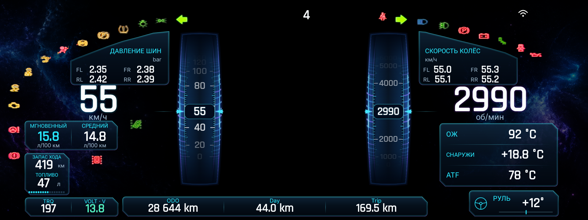

# Скины H9 Cluster

H9 Cluster предоставляет пять независимых скинов для дополнительного экрана
`Display ID 2` размером `1920×720`. Снимок ION AURORA получен в эмуляторе
из Demo; остальные — через `scrcpy` с головного устройства Haval на Android 9.

Показания служат для демонстрации компоновки. На снимке ION AURORA данные
и системные индикаторы демонстрационные, а не состояние реального автомобиля.

## ION AURORA

Космическая тема с полупрозрачными боковыми туманностями и двумя вертикальными
барабанными шкалами. Ленты движутся за неподвижными указателями, риски и
цифры уходят в глубину по краям барабана. Скорость и RPM показываются целыми
числами; показания в окнах барабанов совпадают с крупными цифрами.

Средний и мгновенный расход вынесены в отдельную панель, угол руля отделён
от температур. ATF и остальные доступные автомобильные данные сохранены.
Центр остаётся свободным для карты, а панели обходят штатные индикаторы.
Production не рисует имитацию этих индикаторов и название режима езды.

В ION AURORA, Classic, Sport и Simple приложение дополняет штатную передачу
только цифрой 1–8 в автоматическом режиме D; в M/P/N/R дополнительной
надписи нет. Старые снимки Classic/Sport ниже показывают прежнюю карточку
передачи, удалённую в версии 9.6.0.

## Classic

Классическая компоновка с двумя крупными круговыми шкалами, центральной зоной
для основных показаний и отдельными индикаторами топлива и температуры
охлаждающей жидкости.

## Sport

Спортивная компоновка с протяжёнными шкалами по периметру, красным акцентом и
крупными цифровыми значениями скорости и оборотов.

## Horizon

Сдержанная тёмная тема с бирюзовыми акцентами, разнесёнными информационными
карточками и двумя симметричными приборами.

## Simple

Минималистичная тема с двумя светлыми шкалами и максимально свободной
центральной областью. Основные вспомогательные показатели расположены по
краям экрана.

## Штатная панель

Вариант `Штатная панель` не является отдельным графическим скином: приложение
ничего не рисует на `Display ID 2`, поэтому на экране остаётся заводская
приборная панель автомобиля.
